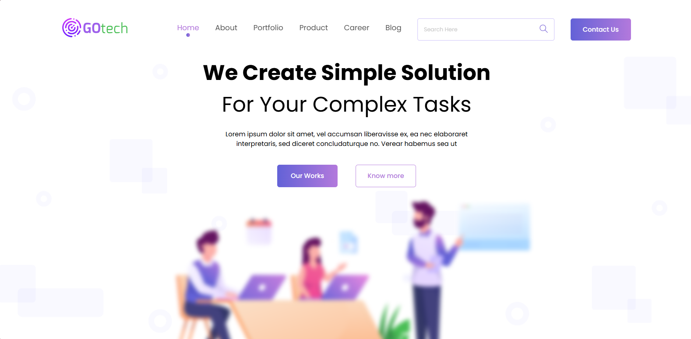

# Gotech

## Overview 
This project is a simple landing page created using HTML, CSS, and JavaScript. The landing page showcases basic web development skills and is designed for a fixed screen size.## Features 
- **Responsive Design**:
  The landing page is fully responsive, adjusting to different screen sizes and devices.
- **Modern CSS**:
  Uses modern CSS techniques, including Flexbox and Grid, to create a visually appealing layout.
- **Interactive Elements**:
  Incorporates JavaScript for interactive elements, such as form validation and dynamic content.
## Technologies Used
- **HTML**:
  Provides the structure of the web page.
- **CSS**:
  Styles the web page, making it visually appealing.
- **JavaScript**:
  Adds interactivity and dynamic behavior to the page.
## How to Run the Project
1. **Clone the Repository**: ```git clone <repository-url>```
2. **Navigate to the Project Directory:** ```cd gotech```
3. **Open** the ```index.html``` file in your Browser: open the ```index.html``` file in any web browser to view the landing page.
## Project Structure
- ```Landing.html```: The main HTML file containing the structure of the landing page.
- ```css/```: The directory containing the CSS files and styles for the landing page.
- ```js/```: The JavaScript file containing the interactive elements.

Feel free to customize further as needed! If you need more help or have other modifications, just let me know!😊
